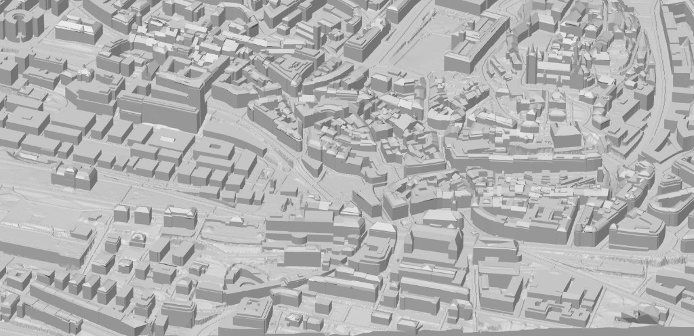

# 🇨🇭 SwissSTL

Generate 3D-printable STL models of any area in Switzerland, with high-detail terrain, buildings, and roads.

SwissSTL combines official swisstopo geodata — **SwissALTI3D** (LiDAR terrain), **swissBUILDINGS3D 2.0** (3D buildings from DXF), and **swissTLM3D** (road vectors) — into watertight, slicer-ready STL files.

## 📸 Preview



## ✨ Features

- 🏔️ **High-resolution terrain** from SwissALTI3D (0.5m, 2m, or 10m LiDAR)
- 🏠 **Accurate 3D buildings** with intact roofs from swissBUILDINGS3D 2.0 (DXF, LV95/LN02 native)
- 🛣️ **Road mesh embossing** from swissTLM3D road centerlines
- 📐 **Four selection modes**: rectangle, circle, freehand drawing, and **PNG mask upload**
- 🖼️ **Custom PNG mask**: upload a black-on-transparent shape to cut your STL in any form
- 🌍 **Multilingual**: French, English, German, Italian, Romansh
- ⚙️ **Configurable**: model width, base thickness, resolution, buildings on/off, roads on/off
- 🧩 **Multi-tile grid split** (2×2, 3×3, 4×4) for printing large zones in parts
- 🔧 **Automatic mesh repair**: normal fixing, degenerate face removal, vertex merging
- 🔍 **Location search**: find any Swiss place by name
- 🗺️ **Satellite / topo map toggle**
- 🖥️ **3D STL preview** in-browser after generation
- 📜 **Generation history** with quick re-download
- ⏱️ **ETA & progress tracking** with live backend status

## 🛠️ Tech Stack

### Backend (Python / FastAPI)

| Library | Role |
|---------|------|
| FastAPI + Uvicorn | Async REST API |
| rasterio | GeoTIFF terrain loading |
| numpy + numpy-stl | STL mesh generation |
| ezdxf | DXF building parsing |
| trimesh | Mesh repair & normals |
| pyproj | Coordinate transforms (WGS84 ↔ LV95) |
| shapely | Road buffering geometry |
| httpx | Async HTTP for swisstopo APIs |

### Frontend (React / TypeScript / Vite)

| Library | Role |
|---------|------|
| React 19 + Vite | UI framework & build |
| MapLibre GL JS | Interactive Swiss map |
| Three.js + @react-three/fiber | 3D STL preview |
| Tailwind-style CSS | Dark theme UI |
| Custom i18n | FR / EN / DE / IT / RM translations |

## 🚀 Getting Started

### Prerequisites

- **Python 3.10+** with pip
- **Node.js 18+** with npm
- ~500 MB disk space for cached swisstopo tiles

### ⚡ One-Click Launcher (Recommended)

**Windows** — double-click:
```
start.bat
```

**macOS / Linux:**
```bash
chmod +x start.sh
./start.sh
```

The launchers will:
- 🔍 Auto-detect Python 3 and Node.js
- 📦 Auto-install via `winget` (Win), `brew` (macOS), or `apt`/`dnf` (Linux) if missing
- 🐍 Create `backend/venv` and install pip dependencies
- 📁 Run `npm install` for the frontend
- 🚀 Start backend (`:8000`) and frontend (`:5173`) together
- 🌐 Open your browser to `http://localhost:5173`

> 💡 **Windows tip:** If you get a PowerShell execution policy error, use `start.bat` instead of `start.ps1`.

### 🔧 Manual Installation

```bash
# Clone the repository
git clone https://github.com/paulreginaphoto/SwissSTL.git
cd SwissSTL

# Backend
cd backend
python -m venv venv
# Windows: venv\Scripts\activate
# macOS/Linux: source venv/bin/activate
pip install -r requirements.txt
cd ..

# Frontend
cd frontend
npm install
cd ..
```

### ▶️ Running Manually

```bash
# Terminal 1 — Backend (port 8000)
cd backend
# activate venv first
uvicorn app.main:app --reload --host 0.0.0.0 --port 8000

# Terminal 2 — Frontend (port 5173)
cd frontend
npm run dev
```

Open **http://localhost:5173** in your browser.

## 🎯 Usage

1. 🔍 Search for a location or navigate the map
2. 📐 Choose a **selection mode** (Rectangle / Circle / Freehand / PNG Mask)
3. ⇧ Hold **Shift** + drag on the map to select your area
4. 🖼️ Optionally upload a **PNG mask** (black shape on transparent) to custom-cut the STL
5. ⚙️ Adjust parameters (resolution, base height, model width)
6. ✅ Toggle buildings and/or roads
7. 🖨️ Click **Generate STL**
8. 📥 Download and open in your slicer!

## 📊 Data Sources

All geographic data is fetched live from official **swisstopo** APIs (free & open data):

| Dataset | Format | API |
|---------|--------|-----|
| [SwissALTI3D](https://www.swisstopo.admin.ch/en/height-model-swissalti3d) | GeoTIFF | STAC API |
| [swissBUILDINGS3D 2.0](https://www.swisstopo.admin.ch/en/landscape-model-swissbuildings3d) | DXF | STAC API |
| [swissTLM3D](https://www.swisstopo.admin.ch/en/landscape-model-swisstlm3d) | GeoJSON | REST Identify API |

Data is cached locally in `backend/cache/` to avoid re-downloading.

## 📁 Project Structure

```
SwissSTL/
├── backend/
│   ├── app/
│   │   ├── main.py              # FastAPI entry point
│   │   ├── models/schemas.py    # Pydantic models
│   │   ├── routers/generate.py  # /api/generate + /api/status
│   │   └── services/
│   │       ├── terrain.py       # SwissALTI3D STAC download
│   │       ├── buildings_dxf.py # swissBUILDINGS3D DXF pipeline
│   │       ├── roads.py         # swissTLM3D road fetching (parallel + cached)
│   │       └── stl_generator.py # STL mesh assembly
│   └── requirements.txt
├── frontend/
│   ├── src/
│   │   ├── App.tsx
│   │   ├── index.css
│   │   ├── components/
│   │   │   ├── MapView.tsx      # Map + drawing tools
│   │   │   ├── Sidebar.tsx      # Controls + progress
│   │   │   ├── SearchBar.tsx    # Location search (Nominatim)
│   │   │   └── StlPreview.tsx   # 3D preview (Three.js)
│   │   ├── utils/
│   │   │   └── maskToPolygon.ts # PNG mask → polygon extraction
│   │   └── i18n/
│   │       ├── translations.ts  # FR/EN/DE/IT/RM strings
│   │       └── I18nContext.tsx   # React context + hook
│   └── package.json
├── start.bat              # 🪟 Windows one-click launcher
├── start.ps1              # 🪟 Windows PowerShell launcher
├── start.sh               # 🐧🍎 macOS/Linux launcher
├── LICENSE
├── .gitignore
└── README.md
```

## 📄 License

MIT License — Copyright (c) 2026 Paul REGINA

See [LICENSE](LICENSE) for details.

## 🙏 Credits

- **[swisstopo](https://www.swisstopo.admin.ch)** for providing excellent open geodata
- Built with [FastAPI](https://fastapi.tiangolo.com/), [React](https://react.dev/), [MapLibre GL JS](https://maplibre.org/), [Three.js](https://threejs.org/), [ezdxf](https://ezdxf.mozman.at/)
